# Information about the train and test datasets:
- Random split sizes: 6952 1738
- Temporal split sizes: 6952 1738
- Class distribution in temporal test set:
    - 0:    0.602417
    - 1:    0.397583
- Class distribution in temporal train set:
    - 1:    0.739499
    - 0:    0.260501
- Class distribution in random train set:
    - 1:    0.671174
    - 0:    0.328826
- Class distribution in random test set:
    - 1:    0.670886
    - 0:    0.329114
- Correlation between the label and each feature:
    - label                  1.000000
    - log_churn              0.522567
    - dmm_unit_size          0.132024
    - dmm_unit_complexity    0.109827
    - hour_cos               0.092922
    - msg_len                0.010839
    - weekday_sin           -0.011977
    - weekday_cos           -0.023410
    - hour_sin              -0.029680
    - time_diff             -0.095136
    - has_fix_word          -0.394903
# Logistic Regression:
## Logistic Regression — Random split (Test results)

### Summary metrics
| Metric | Value |
|---|---:|
| ROC-AUC | 0.8832 |
| PR-AUC (AP) | 0.9414 |
| MCC | 0.5892 |
| Cohen's κ | 0.5785 |
| Accuracy | 0.8009 |

### Classification report (Test, threshold = 0.5)
| Class | Precision | Recall | F1-score | Support |
|---:|---:|---:|---:|---:|
| 0 | 0.6552 | 0.8339 | 0.7338 | 572 |
| 1 | 0.9059 | 0.7847 | 0.8410 | 1166 |
| accuracy |  |  | 0.8009 | 1738 |
| macro avg | 0.7806 | 0.8093 | 0.7874 | 1738 |
| weighted avg | 0.8234 | 0.8009 | 0.8057 | 1738 |

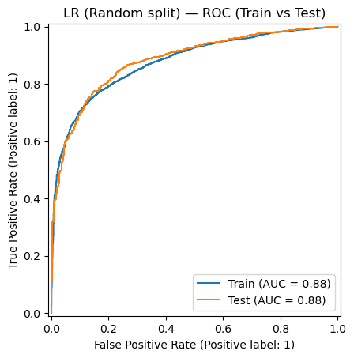

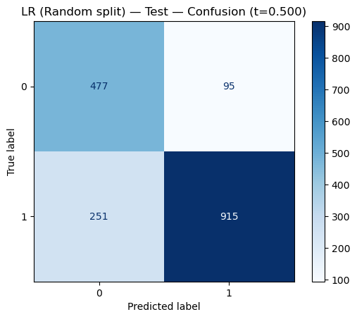

## Logistic Regression — Temporal split (Test results)

**ROC-AUC:** 0.8296 • **PR-AUC (AP):** 0.8057 • **MCC:** 0.5088 • **Cohen's κ:** 0.5086

### Summary metrics
| Metric | Value |
|---|---:|
| Threshold (t) | 0.500 |
| ROC-AUC | 0.8296 |
| PR-AUC (AP) | 0.8057 |
| MCC | 0.5088 |
| Cohen's κ | 0.5086 |
| Accuracy | 0.7635 |

### Classification report (Test, threshold = 0.500)
| Class | Precision | Recall | F1-score | Support |
|---:|---:|---:|---:|---:|
| 0 | 0.8093 | 0.7947 | 0.8019 | 1047 |
| 1 | 0.6972 | 0.7164 | 0.7066 | 691 |
| accuracy |  |  | 0.7635 | 1738 |
| macro avg | 0.7533 | 0.7555 | 0.7543 | 1738 |
| weighted avg | 0.7647 | 0.7635 | 0.7640 | 1738 |

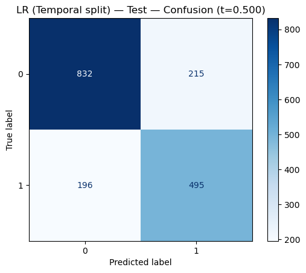

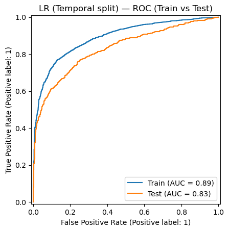

## LR tuned (Temporal split) — Test — metrics @ t=0.213

**ROC-AUC:** 0.8297 • **PR-AUC (AP):** 0.8058 • **MCC:** 0.3462 • **Cohen's κ:** 0.2848

### Summary metrics
| Metric | Value |
|---|---:|
| Threshold (t) | 0.213 |
| ROC-AUC | 0.8297 |
| PR-AUC (AP) | 0.8058 |
| MCC | 0.3462 |
| Cohen's κ | 0.2848 |
| Accuracy | 0.6122 |

### Classification report (Test, threshold = 0.213)
| Class | Precision | Recall | F1-score | Support |
|---:|---:|---:|---:|---:|
| 0 | 0.8650 | 0.4222 | 0.5674 | 1047 |
| 1 | 0.5069 | 0.9001 | 0.6486 | 691 |
| accuracy |  |  | 0.6122 | 1738 |
| macro avg | 0.6859 | 0.6612 | 0.6080 | 1738 |
| weighted avg | 0.7226 | 0.6122 | 0.5997 | 1738 |

## p-values for logistic regression
- Significant (p<0.05):
    - const           3.880706e-310
    - log_churn       5.667398e-237
    - has_fix_word     1.542403e-72
    - time_diff        1.616709e-19
    - hour_cos         1.047175e-03
    - msg_len          4.030560e-03
    - weekday_sin      4.490449e-02
    - weekday_cos      4.588335e-02

# Decision tree

## Decision Tree (Random split) — Test — metrics @ t=0.500

**ROC-AUC:** 0.8599 • **PR-AUC (AP):** 0.9117 • **MCC:** 0.5577 • **Cohen's κ:** 0.5462

### Summary metrics
| Metric | Value |
|---|---:|
| Threshold (t) | 0.500 |
| ROC-AUC | 0.8599 |
| PR-AUC (AP) | 0.9117 |
| MCC | 0.5577 |
| Cohen's κ | 0.5462 |
| Accuracy | 0.7848 |

### Classification report (Test, threshold = 0.500)
| Class | Precision | Recall | F1-score | Support |
|---:|---:|---:|---:|---:|
| 0 | 0.6341 | 0.8182 | 0.7145 | 572 |
| 1 | 0.8960 | 0.7684 | 0.8273 | 1166 |
| accuracy |  |  | 0.7848 | 1738 |
| macro avg | 0.7651 | 0.7933 | 0.7709 | 1738 |
| weighted avg | 0.8098 | 0.7848 | 0.7902 | 1738 |

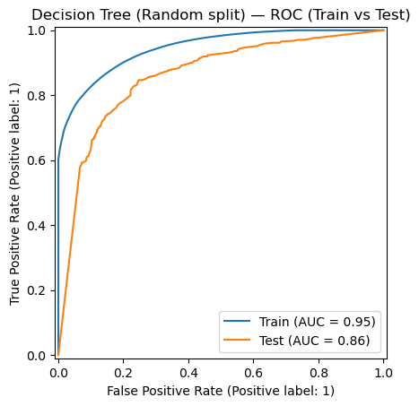

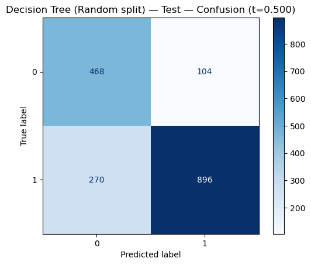

## Decision Tree (Temporal split) — Test — metrics @ t=0.500

**ROC-AUC:** 0.7799 • **PR-AUC (AP):** 0.6834 • **MCC:** 0.4047 • **Cohen's κ:** 0.3987

### Summary metrics
| Metric | Value |
|---|---:|
| Threshold (t) | 0.500 |
| ROC-AUC | 0.7799 |
| PR-AUC (AP) | 0.6834 |
| MCC | 0.4047 |
| Cohen's κ | 0.3987 |
| Accuracy | 0.7014 |

### Classification report (Test, threshold = 0.500)
| Class | Precision | Recall | F1-score | Support |
|---:|---:|---:|---:|---:|
| 0 | 0.7940 | 0.6810 | 0.7332 | 1047 |
| 1 | 0.6024 | 0.7323 | 0.6610 | 691 |
| accuracy |  |  | 0.7014 | 1738 |
| macro avg | 0.6982 | 0.7066 | 0.6971 | 1738 |
| weighted avg | 0.7178 | 0.7014 | 0.7045 | 1738 |

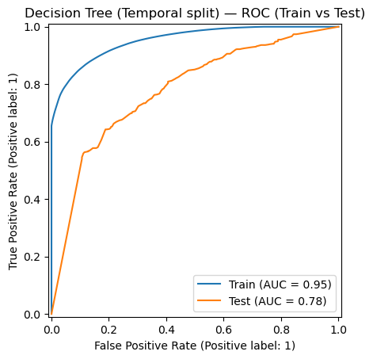

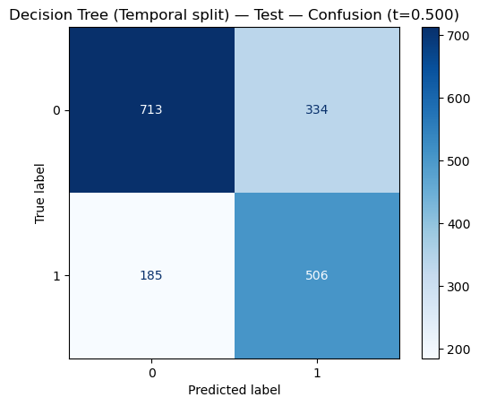

## Decision Tree tuned (Temporal split) — Test — metrics @ t=0.500

**ROC-AUC:** 0.8255 • **PR-AUC (AP):** 0.7793 • **MCC:** 0.5099 • **Cohen's κ:** 0.5099

### Summary metrics
| Metric | Value |
|---|---:|
| Threshold (t) | 0.500 |
| ROC-AUC | 0.8255 |
| PR-AUC (AP) | 0.7793 |
| MCC | 0.5099 |
| Cohen's κ | 0.5099 |
| Accuracy | 0.7652 |

### Classification report (Test, threshold = 0.500)
| Class | Precision | Recall | F1-score | Support |
|---:|---:|---:|---:|---:|
| 0 | 0.8052 | 0.8052 | 0.8052 | 1047 |
| 1 | 0.7048 | 0.7048 | 0.7048 | 691 |
| accuracy |  |  | 0.7652 | 1738 |
| macro avg | 0.7550 | 0.7550 | 0.7550 | 1738 |
| weighted avg | 0.7652 | 0.7652 | 0.7652 | 1738 |

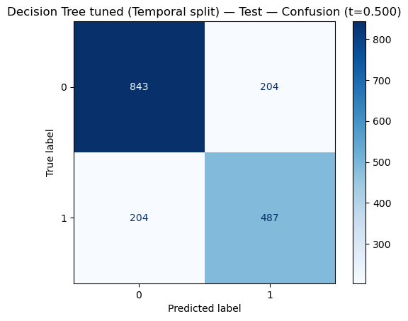

## Feature importance:

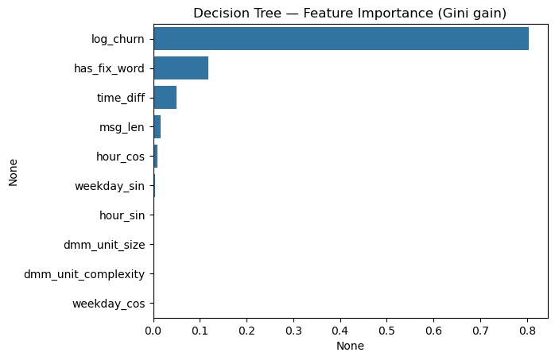

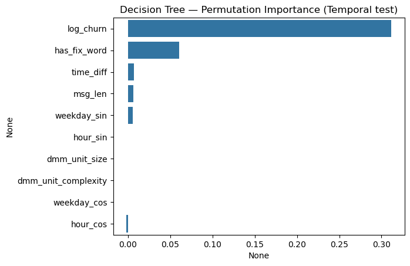

## Hyper-parameter tunning:

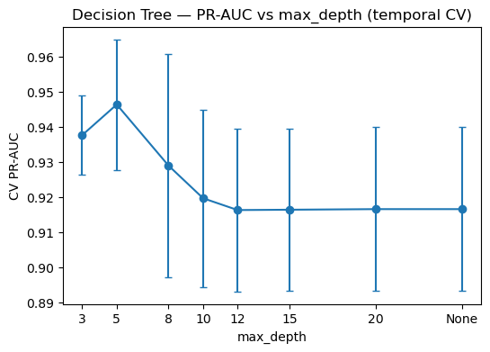

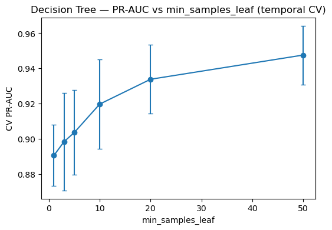

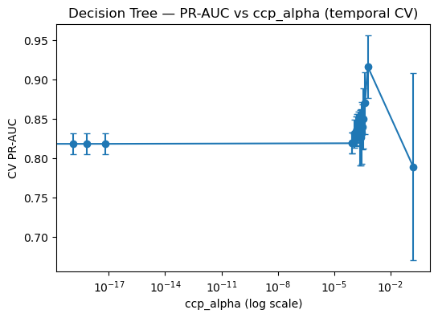

# Random Forest

**All random forest values are chosen based on Gridsearch tunning method**

**Number of estimators:** 200 • **min samples per leaf:** 8 • **min samples before split:** 20

## Random Forest (Temporal split) — Test — metrics @ t=0.500

**ROC-AUC:** 0.8346 • **PR-AUC (AP):** 0.7985 • **MCC:** 0.5027 • **Cohen's κ:** 0.4984

### Summary metrics
| Metric | Value |
|---|---:|
| Threshold (t) | 0.500 |
| ROC-AUC | 0.8346 |
| PR-AUC (AP) | 0.7985 |
| MCC | 0.5027 |
| Cohen's κ | 0.4984 |
| Accuracy | 0.7532 |

### Classification report (Test, threshold = 0.500)
| Class | Precision | Recall | F1-score | Support |
|---:|---:|---:|---:|---:|
| 0 | 0.8301 | 0.7421 | 0.7837 | 1047 |
| 1 | 0.6633 | 0.7699 | 0.7127 | 691 |
| accuracy |  |  | 0.7532 | 1738 |
| macro avg | 0.7467 | 0.7560 | 0.7482 | 1738 |
| weighted avg | 0.7638 | 0.7532 | 0.7554 | 1738 |

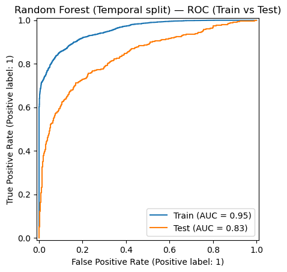

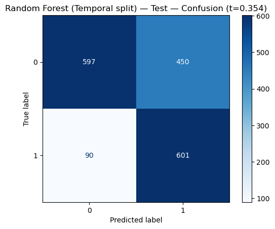

## Random Forest (Random split) — Test — metrics @ t=0.500

**ROC-AUC:** 0.8960 • **PR-AUC (AP):** 0.9467 • **MCC:** 0.6202 • **Cohen's κ:** 0.6146

### Summary metrics
| Metric | Value |
|---|---:|
| Threshold (t) | 0.500 |
| ROC-AUC | 0.8960 |
| PR-AUC (AP) | 0.9467 |
| MCC | 0.6202 |
| Cohen's κ | 0.6146 |
| Accuracy | 0.8216 |

### Classification report (Test, threshold = 0.500)
| Class | Precision | Recall | F1-score | Support |
|---:|---:|---:|---:|---:|
| 0 | 0.6926 | 0.8234 | 0.7524 | 572 |
| 1 | 0.9045 | 0.8208 | 0.8606 | 1166 |
| accuracy |  |  | 0.8216 | 1738 |
| macro avg | 0.7986 | 0.8221 | 0.8065 | 1738 |
| weighted avg | 0.8348 | 0.8216 | 0.8250 | 1738 |

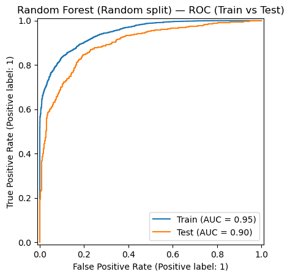

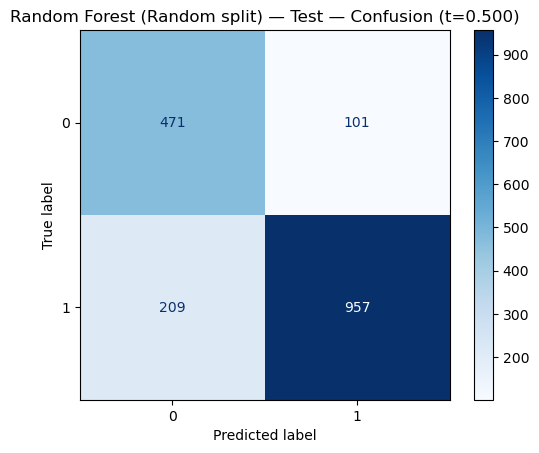

## Feature importance:

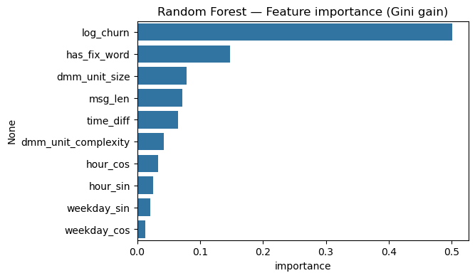

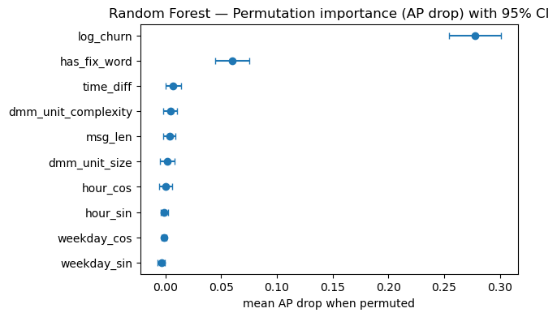
